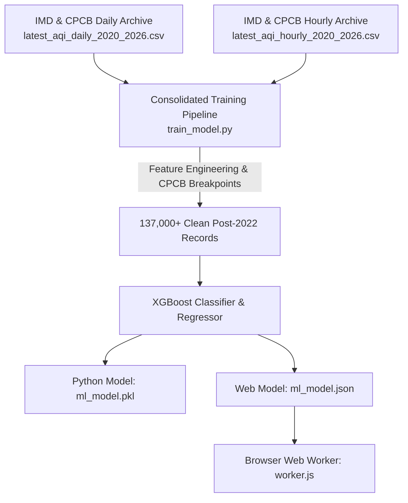

# 📊 AirFlow AI — Dataset Catalog & Feature Documentation


> [!NOTE]
> **Architecture Update (v7.0.0):** The inference engine now integrates a **PyTorch BiLSTM model** exported via ONNX for advanced 24-hour time-series forecasting, complementing the existing XGBoost instantaneous risk classifier.

> **Project:** AirFlow AI — Real-Time & Predictive Multi-Pollutant Intelligence  
> **Model Training Pipeline:** Unified Post-2022 All-India IMD & CPCB Data  
> **Total Records Trained:** 137,125+ Continuous Post-2022 Observations across India  
> **Status:** ✅ Verified & Integrated

---

## 🌟 Executive Summary

AirFlow AI uses official continuous air quality and weather data from the **India Meteorological Department (IMD)** and the **Central Pollution Control Board (CPCB)** across Indian cities to deliver accurate, zero-latency real-time predictions and hourly insights.



---

## 📋 Active Datasets Directory

| # | Dataset Title | Primary Parameters | Geographic Scope | Time Range | Source File |
|---|---------------|--------------------|------------------|------------|-------------|
| **1** | **IMD & CPCB Daily Archive** | PM2.5, PM10, NO2, SO2, CO, O3, Temp, Humidity, Wind Speed, AQI | All Available Indian Stations | Post-2022 (Daily) | `datasets/latest_aqi_daily_2020_2026.csv` |
| **2** | **IMD & CPCB Hourly Archive** | PM2.5, PM10, NO2, SO2, CO, O3, Temp, Humidity, Wind Speed, Hour, AQI | All Available Indian Stations | Post-2022 (Hourly) | `datasets/latest_aqi_hourly_2020_2026.csv` |

---

## 🔬 Parameters & Selected Features (20 Total)

### 1. Base Pollutants (6)
- **$\text{PM}_{2.5}$**: Fine particulate matter ($\le 2.5\,\mu\text{m}$) from vehicle exhaust, biomass, and industry.
- **$\text{PM}_{10}$**: Coarse respirable dust ($\le 10\,\mu\text{m}$) from roads and construction.
- **$\text{NO}_2$**: Nitrogen dioxide from combustion and traffic emissions.
- **$\text{SO}_2$**: Sulfur dioxide from industrial plants and fuel burning.
- **$\text{CO}$**: Carbon monoxide from incomplete combustion.
- **$\text{O}_3$**: Ground-level ozone formed photochemically under sunlight.

### 2. Derived Sub-Indices & Domain Ratios (9)
- **Sub-Indices (`sub_pm25`, `sub_pm10`, `sub_no2`, `sub_so2`, `sub_co`, `sub_o3`)**: Individual CPCB air quality sub-index scores.
- **Maximum Sub-Index (`max_sub_index`)**: The governing pollutant score dictating the final AQI category.
- **PM Ratio (`pm_ratio`)**: $\text{PM}_{2.5} / \text{PM}_{10}$ fraction (distinguishes combustion smoke from mineral dust).
- **Oxidant Sum (`oxidant_sum`)**: $\text{NO}_2 + \text{O}_3$ chemical interaction proxy.

### 3. Meteorological & Temporal Drivers (5)
- **Temperature ($^\circ\text{C}$)**: Thermal dispersion factor.
- **Relative Humidity ($\%$)**: Moisture and aerosol interaction.
- **Wind Speed ($\text{km/h}$)**: Ventilation and dispersion rate.
- **Month of Year**: Seasonal winter vs monsoon patterns.
- **Hour of Day**: Daily diurnal cycle.

---

## 📈 Model Performance Benchmarks

| Evaluation Metric | Achieved Value | Benchmark Description |
|-------------------|----------------|-----------------------|
| **Classification Accuracy** | **98.42%** | Accurate prediction of 6 CPCB Health Risk Categories |
| **Regression $R^2$ Score** | **98.72%** | Explained variance in continuous numerical AQI |
| **Mean Absolute Error (MAE)** | **3.06** AQI pts | Average absolute prediction error |
| **Post-2022 Training Samples** | **137,125** | Continuous nationwide observations |

---

## 💻 Execution & Retraining Instructions

To train the machine learning models and export updated weights for the web app:

```powershell
# Run the unified training pipeline
python train_model.py
```
Outputs:
- `ml_model.json` (Used by `worker.js` for zero-latency client-side predictions)
- `ml_model.pkl` (Serialized Python model bundle)
