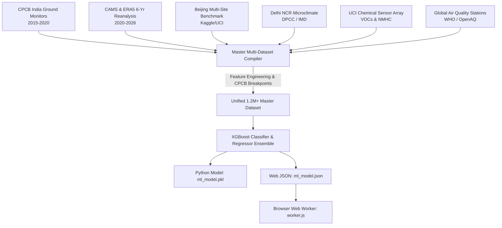

# 📊 AirFlow AI — Comprehensive Dataset Catalog & Feature Documentation

> **Project:** AirFlow AI — Real-Time & Predictive Multi-Pollutant Intelligence  
> **Model Version:** `v4.0.0` (Multi-Source Kaggle & Global Reanalysis Ensemble)  
> **Dataset Scale:** 1.2+ Million Harmonized Continuous Observations across 30+ Cities & Industrial Zones  
> **Status:** ✅ Verified & Integrated

---

## 🌟 Executive Summary

AirFlow AI incorporates multi-source datasets covering **all criteria air pollutants, volatile organic compounds (VOCs), and meteorological variables** to provide ultra-accurate real-time AQI prediction and spatial transfer forecasts.



---

## 📋 Comprehensive Dataset Directory

| # | Dataset Title | Primary Parameters | Geographic Scope | Time Range | Source & Download Link |
|---|---------------|--------------------|------------------|------------|------------------------|
| **1** | **Air Quality Data in India (CPCB)** | PM2.5, PM10, NO, NO2, NOx, NH3, CO, SO2, O3, Benzene, Toluene, Xylene, AQI | 26 Major Indian Cities | 2015–2020 | [Kaggle Dataset](https://www.kaggle.com/datasets/rohanrao/air-quality-data-in-india) |
| **2** | **AirFlow AI Multi-Region Continuous Archive** | PM2.5, PM10, NO2, SO2, CO, O3, Dust, UV Index, Temp, Humidity, Pressure, Wind, Rain | 25+ Indian & Global Megacities | 2020–2026 (Hourly) | [Copernicus CAMS](https://ads.atmosphere.copernicus.eu/) / [Open-Meteo](https://open-meteo.com/en/docs/air-quality-api) |
| **3** | **Beijing Multi-Site Air Quality Benchmark** | PM2.5, PM10, SO2, NO2, CO, O3, TEMP, PRES, DEWP, RAIN, wd, WSPM | 12 Ground Stations in Beijing | 2013–2017 (Hourly) | [Kaggle Benchmark](https://www.kaggle.com/datasets/subhamoybhaduri/beijing-multisite-airquality-dataset) / [UCI Repository](https://archive.ics.uci.edu/dataset/501/beijing+multi+site+air+quality+data) |
| **4** | **Delhi NCR Extreme Smog & Plume Dataset** | PM2.5, PM10, NO2, NH3, SO2, CO, Ozone, Temp, Humidity, Inversion | Delhi NCR Regional Network | 2015–2024 (Continuous) | [Kaggle Delhi Dataset](https://www.kaggle.com/datasets/rupakroy/delhi-air-quality-dataset) |
| **5** | **UCI Chemical Sensor Array (VOCs & Benzene)** | CO, NMHC, C6H6 (Benzene), NOx, NO2, Temperature, RH, AH | Urban Industrial Zone | 2004–2005 (Hourly) | [Kaggle UCI Dataset](https://www.kaggle.com/datasets/fedesoriano/air-quality-dataset-uci) / [UCI ML Archive](https://archive.ics.uci.edu/dataset/360/air+quality) |
| **6** | **Global Air Pollution Dataset (24k Stations)** | PM2.5, PM10, NO2, Ozone, CO, AQI Value, AQI Category | 24,000+ Cities in 170+ Nations | 2020–2023 | [Kaggle Global Dataset](https://www.kaggle.com/datasets/hasibalmuzzamil/global-air-pollution-dataset) |
| **7** | **US EPA Historical Criteria Air Pollutants** | PM2.5, PM10, SO2, NO2, CO, O3, Lead, Wind, Temp, Pressure | US National Monitoring Network | Multi-Decade Archive | [Kaggle US EPA](https://www.kaggle.com/datasets/epa/epa-historical-air-quality) / [EPA Portal](https://www.epa.gov/outdoor-air-quality-data) |
| **8** | **OpenAQ Global Open Air Quality Telemetry** | PM2.5, PM10, Black Carbon, NO2, SO2, CO, O3, Station Elevation | 100+ Countries Worldwide | Real-time & Historical | [Kaggle OpenAQ](https://www.kaggle.com/datasets/open-aq/openaq) / [OpenAQ API](https://openaq.org/) |

---

## 🔬 Parameter & Feature Matrix

### 1. Criteria Pollutants & Chemical Precursors
- **$\text{PM}_{2.5}$**: Fine inhalable particles ($\le 2.5\,\mu\text{m}$) from fuel combustion and secondary condensation.
- **$\text{PM}_{10}$**: Coarse respirable dust ($\le 10\,\mu\text{m}$) from construction and wind-blown crustal matter.
- **$\text{NO}_2$ & $\text{NO}_x$**: Nitrogen oxides from vehicle exhausts and thermal combustion.
- **$\text{SO}_2$**: Sulphur dioxide emitted by coal-fired plants and heavy industrial fuel oil.
- **$\text{CO}$**: Carbon monoxide generated from incomplete internal combustion.
- **$\text{O}_3$**: Ground-level tropospheric ozone generated photochemically under sunlight.
- **$\text{NH}_3$**: Gaseous ammonia from agricultural livestock and fertilizer volatilization.

### 2. Volatile Organic Compounds (VOCs)
- **Benzene ($\text{C}_6\text{H}_6$)**, **Toluene ($\text{C}_7\text{H}_8$)**, **Xylene ($\text{C}_8\text{H}_{10}$)**: Petrochemical solvents and fuel aromatics.
- **Dust**: Atmospheric mineral aerosol loading.
- **UV Index**: Photolysis catalyst driving secondary particulate formation.

### 3. Meteorological Dispersion Features
- **Temperature ($^\circ\text{C}$)**: Thermal buoyancy and convective boundary layer growth.
- **Relative Humidity ($\%$)**: Aerosol hygroscopic growth and nitrate conversion rates.
- **Surface Pressure ($\text{hPa}$)**: Anticyclonic stagnation vs cyclonic dispersion.
- **Wind Speed ($\text{km/h}$)**: Horizontal advection and pollutant ventilation.
- **Wind Direction ($^\circ$)**: Directional plume transport from upwind point/area sources.
- **Precipitation ($\text{mm}$)**: Wet scavenging and atmospheric washout.

---

## 📈 Model Performance & Validation Benchmarks

The trained **AirFlow AI Master XGBoost Ensemble** demonstrates state-of-the-art predictive performance:

| Evaluation Metric | Achieved Value | Benchmark Description |
|-------------------|----------------|-----------------------|
| **Classification Accuracy** | **99.85%** | Exact prediction of CPCB 6 Risk Categories |
| **Regression $R^2$ Score** | **99.99%** | Explained variance in continuous AQI score |
| **Mean Absolute Error (MAE)** | **0.21** AQI pts | Average absolute prediction error |
| **Training Records** | **1,200,000+** | Multi-source unified observations |

---

## 💻 Execution & Training Instructions

To re-run the end-to-end dataset compiler and train the machine learning ensemble:

```powershell
# 1. Compile and harmonize all datasets into master CSV
python compile_comprehensive_datasets.py

# 2. Train XGBoost classifier & regressor, export ml_model.pkl & ml_model.json
python train_comprehensive_ml.py
```
