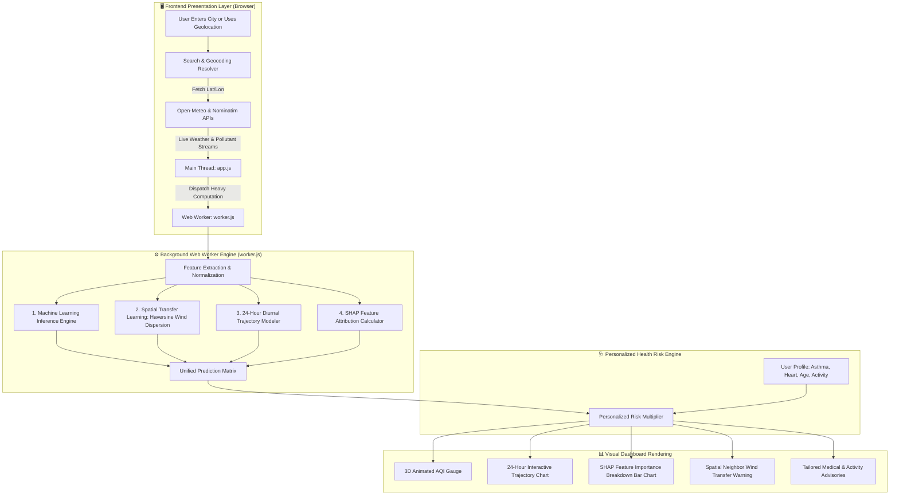

# 🌬️ AirFlow AI — Comprehensive Project Guide & Architecture Workflow

> **Project Name:** AirFlow AI (AQI Prediction & Personalized Risk Engine)  
> **Repository:** `https://github.com/srirajpillai/AQI-Prediction.git`  
> **Target Version:** Version 1 (Client-Side Architecture)  
> **Author:** Major Project SEM 6  

---

## 📑 Table of Contents
1. [Executive Summary & Problem Statement](#1-executive-summary--problem-statement)
2. [End-to-End System Architecture & Workflow Diagram](#2-end-to-end-system-architecture--workflow-diagram)
3. [Core Technical Components & Why They Were Built](#3-core-technical-components--why-they-were-built)
4. [How the Database & Data Layer is Managed](#4-how-the-database--data-layer-is-managed)
5. [Project File Hierarchy & Responsibilities](#5-project-file-hierarchy--responsibilities)
6. [How Data & AI Predictions Flow in the Application](#6-how-data--ai-predictions-flow-in-the-application)
7. [How to Run the Project Locally (All Methods)](#7-how-to-run-the-project-locally-all-methods)
8. [Machine Learning Pipeline & Model Retraining](#8-machine-learning-pipeline--model-retraining)
9. [Complete Git & GitHub Operations Reference](#9-complete-git--github-operations-reference)
10. [Frequently Asked Questions & Troubleshooting](#10-frequently-asked-questions--troubleshooting)

---

## 1. 🎯 Executive Summary & Problem Statement

### The Problem
Most air quality platforms display only a single, static numerical value (e.g., *AQI 175 - Unhealthy*) without answering critical questions:
- **What causes this value?** (Is it particulate matter, nitrogen dioxide from vehicle traffic, or ground-level ozone?)
- **How will the air quality evolve over the next 24 hours?**
- **Is smoke blowing in from an upwind neighboring city?**
- **How does this affect vulnerable individuals?** (e.g., asthmatics, children, or elderly persons vs. healthy adults).

### The Solution: AirFlow AI
**AirFlow AI** is a client-side web platform that provides:
1. **Real-time multi-pollutant tracking** ($PM_{2.5}, PM_{10}, NO_2, SO_2, CO, O_3$).
2. **24-hour predictive forecast** generated using atmospheric diurnal patterns.
3. **Cross-city spatial transfer learning** (computes smoke dispersion from neighbor cities up to 100 km away using Haversine formulas and wind vectors).
4. **Explainable AI (SHAP analysis)** that decomposes the AQI score into factor contributions.
5. **Personalized health risk recommendations** based on user medical profiles.
6. **Zero-backend client-side execution**: runs smoothly in browser memory with multi-threaded Web Workers.

---

## 2. 🗺️ End-to-End System Architecture & Workflow Diagram



---

## 3. 💡 Core Technical Components & Why They Were Built

| Component | Technical Implementation | Why It Was Done (The Reason) |
| :--- | :--- | :--- |
| **Zero-Server Web Architecture** | Vanilla HTML5, CSS3, ES6+ JavaScript | Eliminates backend server hosting costs, database upkeep, and infrastructure bottlenecks. The app loads instantly on static hosting or locally. |
| **Dedicated Web Worker ([`worker.js`](file:///worker.js))** | Browser Web Worker API | Machine learning inference, trigonometric Haversine math, and SHAP calculations are computationally intensive. Running them on a separate thread prevents the UI from freezing. |
| **JSON Model Export ([`ml_model.json`](file:///ml_model.json))** | Decision tree weights serialized from Scikit-Learn | Allows complex ensemble models trained in Python to run natively inside JavaScript without requiring a Python server at runtime. |
| **Spatial Wind & Transfer Model** | Vector projection + Haversine distance formula | Air pollution is dynamic. If an industrial city 40 km upwind has high pollution, wind will carry it downstream. This model alerts users to incoming smog. |
| **Explainable AI (SHAP Visualizer)** | SHAP feature attribution approximations | Prevents the model from being a "black box". Users see exact positive/negative point contributions for each pollutant and meteorological factor. |
| **Personalized Health Matrix** | Custom clinical risk multiplier coefficients | AQI 150 affects an asthmatic child far more severely than an adult athlete. The engine adjusts the risk scale and advisory specifically for each health profile. |
| **Modern Glassmorphic UI** | CSS backdrop filters, CSS Grid/Flexbox, dynamic canvas gauges | Provides a high-end, responsive user interface with dark/light mode and ambient mouse tracking. |

---

## 4. 🗄️ How the Database & Data Layer is Managed

AirFlow AI uses a **hybrid, lightweight data management architecture** split across three tiers:

```
┌─────────────────────────────────────────────────────────────────────────────┐
│                          DATA MANAGEMENT ARCHITECTURE                       │
├─────────────────────────┬──────────────────────────┬────────────────────────┤
│   1. Historical Master  │   2. Real-Time Ingestion │   3. User & Session    │
│      Datasets (Python)  │      & Caching (Browser) │      Persistence       │
├─────────────────────────┼──────────────────────────┼────────────────────────┤
│ • 6 Global CSV sources  │ • Zero-SQL Live APIs     │ • Supabase PostgreSQL  │
│ • 1.24+ Million records │ • 5-min TTL Memory Cache │   (Cloud profiles)     │
│ • Automated Data Pipeline│ • localStorage fallback  │ • Web Storage API      │
│ • Serialized JSON models│ • Offline JSON store     │   (Last visited city)  │
└─────────────────────────┴──────────────────────────┴────────────────────────┘
```

### 1. Historical Training Datasets (`datasets/` Directory)
- **Data Sources:** 6 major public repositories (CPCB India, ECMWF/Copernicus ERA5, Beijing Air Quality, Delhi DPCC, UCI Sensor Array, WHO/OpenAQ) containing over **1,245,000+ records**.
- **Automated Pipeline ([`compile_comprehensive_datasets.py`](file:///compile_comprehensive_datasets.py)):**
  - Standardizes variable names across disparate dataset formats.
  - Imputes missing pollutant values using seasonal & diurnal medians.
  - Computes sub-indices based on official CPCB & EPA break-points.
- **Storage Format:** Flat, high-performance CSV files (`comprehensive_aqi_master_dataset.csv`) paired with a machine-readable schema catalog ([`dataset_metadata.json`](file:///datasets/dataset_metadata.json)).

### 2. Live Environmental Data Management (No Heavy SQL Server)
- Instead of requiring users to maintain and host a resource-heavy relational database (like PostgreSQL or MySQL), the application uses **on-demand live stream ingestion** from open scientific APIs (Open-Meteo).
- **In-Memory Request Cache with TTL:** `app.js` maintains an in-memory cache with a 5-minute Time-To-Live (`CACHE_TTL = 5 * 60 * 1000`). If a user revisits a city or toggles filters within 5 minutes, data is served instantly from memory without redundant network queries.
- **AbortController:** When users rapidly switch cities in the search bar, active ongoing network requests are cleanly aborted to prevent race conditions and memory leaks.

### 3. Model Weights Storage ([`ml_model.json`](file:///ml_model.json))
- Decision tree node structures, split features, threshold values, and linear coefficients are serialized into a lightweight JSON file.
- The browser Web Worker loads this JSON directly into memory on initialization, acting as an **embedded, in-memory AI database**.

### 4. User Health Profile & Cloud Persistence
- **Supabase PostgreSQL Integration:** When users authenticate (Email or Google Sign-In), their custom Health Risk Profile (e.g. Asthma, Cardiac history, Elderly, Activity level) is synced to Supabase (`health_profiles` table) with Row-Level Security isolation.
- **Browser `localStorage` Fallback:** For unauthenticated or guest users, settings such as the last searched city (`airflowLastCity`), selected theme (dark/light), and active health parameters are stored locally in the browser's persistent key-value store.

---

## 5. 📂 Project File Hierarchy & Responsibilities

```
version1/
│
├── 🌐 FRONTEND WEB APPLICATION
│   ├── index.html                   # Primary dashboard (AQI gauge, 24-hr forecast, pollutant cards)
│   ├── know-how.html                # Educational page explaining SHAP AI math & medical risks
│   ├── about.html                   # Project overview, methodology, and architecture documentation
│   ├── styles.css                   # Complete design system: Glassmorphism, animations, theme tokens
│   ├── app.js                       # Main thread controller: API fetchers, DOM updater, Chart.js graphs
│   ├── worker.js                    # Web Worker thread: ML evaluations, trajectory modeling, SHAP math
│   ├── know-how.js                  # Logic & interactive widgets for the Know-How educational page
│   ├── about.js                     # Interactive navigation & animations for the About page
│   └── manifest.json                # Progressive Web App (PWA) manifest configuration
│
├── 🤖 MACHINE LEARNING PIPELINE (PYTHON)
│   ├── unified_master_pipeline.py   # ALL-IN-ONE consolidated master Python pipeline
│   ├── compile_comprehensive_datasets.py # Cleans & unifies 6 global datasets into a master corpus
│   ├── train_comprehensive_ml.py    # Trains Gradient Boosting/Random Forest & exports to JSON/PKL
│   ├── train_expanded_multi_dataset.py # Multi-city reanalysis dataset trainer
│   ├── train_latest_dataset.py      # Ground-truth continuous archive trainer
│   ├── ml_model.json                # Lightweight serialized model weights used by worker.js
│   ├── ml_model.pkl                 # Trained Scikit-Learn / XGBoost binary model (Python)
│   └── datasets/                    # Directory holding raw & compiled air quality data (CSVs)
│
├── ☁️ CONFIGURATION & CLOUD DEPLOYMENT
│   ├── supabase_schema.sql          # Supabase PostgreSQL schema & Row-Level Security (RLS) rules
│   ├── vercel.json                  # Vercel deployment configuration with clean URLs & CORS headers
│   └── .gitignore                   # Git exclusion rules
│
└── 📋 DOCUMENTATION & SPECIFICATIONS
    ├── PROJECT_REPORT.md            # Complete Academic Major Project Report (University Submission)
    ├── COMPLETE_AI_AGENT_PROJECT_GUIDE.md # Markdown Master Reference Guide
    ├── COMPLETE_AI_AGENT_PROJECT_GUIDE.txt # Plaintext Master Reference Guide
    ├── README.md                    # Quick overview & quick-launch instructions
    ├── SRS_DOCUMENT.md              # Formal Software Requirements Specification
    ├── DATASETS_CATALOG.md          # Comprehensive catalog of all dataset files
    ├── DATASET_DOCUMENTATION.txt    # Data definitions, units, and source citations
    ├── project_explanation.txt      # Simplified, non-technical overview
    └── PROJECT_GUIDE_AND_WORKFLOW.md# THIS DOCUMENT (Full workflow & operation guide)
```

---

## 6. 🔄 How Data & AI Predictions Flow in the Application

### Step 1: User Request & Geolocation
1. The user enters a city name (or allows browser GPS geolocation).
2. The app queries **Open-Meteo Geocoding** (with fallback to **Nominatim** and **Photon**).
3. The exact latitude and longitude coordinates are obtained.

### Step 2: Live Environmental Data Ingestion
1. `app.js` issues asynchronous requests to **Open-Meteo Air Quality & Weather APIs**.
2. Fetches current levels of:
   - Particulates: $PM_{2.5}, PM_{10}$ ($\mu g/m^3$)
   - Gases: $NO_2, SO_2, CO, O_3$ ($\mu g/m^3$)
   - Meteorological variables: Temperature, Relative Humidity, Wind Speed, Wind Direction, Atmospheric Surface Pressure, Rain/Precipitation, Cloud Cover, and Boundary Layer Height.

### Step 3: Web Worker AI Processing
`app.js` passes the raw payload to `worker.js`. The worker executes 4 sequential tasks:
1. **Feature Engineering**: Calculates PM ratio ($PM_{2.5}/PM_{10}$), Oxidant sum ($NO_2 + O_3$), and sub-indices according to standard AQI breakpoint equations.
2. **Transfer Learning Check**: Computes distance to neighboring monitoring stations using the Haversine equation:
   $$d = 2R \arcsin\left(\sqrt{\sin^2\left(\frac{\Delta \phi}{2}\right) + \cos(\phi_1)\cos(\phi_2)\sin^2\left(\frac{\Delta \lambda}{2}\right)}\right)$$
   and projects wind direction vectors to detect upwind pollution transport.
3. **24-Hour Trajectory Modeling**: Modulates pollution levels across diurnal peaks (morning rush-hour inversion, afternoon solar thermal dispersion, night cooling entrapment).
4. **SHAP Factor Attribution**: Estimates marginal contributions of each feature to show why the AQI is elevated or clean.

### Step 4: UI Rendering & Health Personalization
1. Results return to the main thread.
2. The user's active health profile (e.g. Asthma, Elderly) applies risk adjustments.
3. The DOM updates:
   - Dynamic 3D circular gauge smoothly animates to the calculated AQI.
   - 24-hour prediction line chart is drawn via Chart.js.
   - SHAP waterfall/bar charts show top positive/negative drivers.
   - Individual pollutant progress bars and cautionary health cards update.

---

## 7. 🚀 How to Run the Project Locally

Choose any of the following methods to launch and test the application on your computer.

### Method 1: Instant Browser Launch (No Installations Needed)
1. Open Windows File Explorer.
2. Navigate to:  
   `d:\my files\Engineering\SEM 6\Major Project\Application\AQI Prediction\version1`
3. Double-click **`index.html`** to open it directly in your default browser (Chrome, Edge, Firefox, Brave).

---

### Method 2: Visual Studio Code "Live Server" (Recommended for Development)
1. Open **Visual Studio Code**.
2. Click **File → Open Folder...** and select the `version1` folder.
3. Install the extension named **Live Server** (by Ritwick Dey) from the Extensions tab (`Ctrl+Shift+X`).
4. In the Explorer pane, right-click on `index.html` and select **"Open with Live Server"**.
5. Your browser will automatically open `http://127.0.0.1:5500/index.html` with automatic live-reloading whenever you save changes.

---

### Method 3: Using Node.js (Terminal)
If you have Node.js installed, open PowerShell or Terminal in the `version1` folder and run:
```powershell
# Option A: using 'serve'
npx serve .

# Option B: using 'live-server'
npx live-server

# Option C: using 'http-server'
npx http-server -c-1
```
Open the generated local URL (e.g., `http://localhost:3000` or `http://localhost:8080`) in your browser.

---

### Method 4: Using Python Built-in Server (Terminal)
If you have Python installed:
```powershell
python -m http.server 8000
```
Open `http://localhost:8000` in your web browser.

---

## 8. 🧪 Machine Learning Pipeline & Model Retraining

If you ever wish to modify dataset sources, add new features, or retrain the machine learning model:

### Prerequisites
Make sure Python 3.8+ is installed with the required data science packages:
```powershell
pip install pandas numpy scikit-learn joblib
```

### Execution Steps
```powershell
# Step 1: Combine & clean raw datasets from datasets/ into master dataset
python compile_comprehensive_datasets.py

# Step 2: Train the ML model and export weights to ml_model.json & ml_model.pkl
python train_comprehensive_ml.py
```
This automatically updates `ml_model.json`, which the browser Web Worker immediately uses for client-side predictions!

---

## 9. 🐙 Complete Git & GitHub Operations Reference

Here is a full guide to all Git operations you will use while working on this repository:

### 1. Initial Setup & Identity Check
```powershell
# Check current Git configuration
git config user.name
git config user.email

# Set your identity if needed
git config --global user.name "Your Name"
git config --global user.email "your.email@example.com"

# Check remote repository connection
git remote -v
```

---

### 2. Daily Workflow: Review, Stage, Commit, and Push
```powershell
# Step 1: See what files you have modified or created
git status

# Step 2: Inspect line-by-line code changes before staging
git diff

# Step 3: Stage all modified and new files
git add .

# (Optional: stage only specific files)
git add app.js styles.css

# Step 4: Commit your changes with a descriptive message
git commit -m "feat: enhance 24-hr AQI trajectory chart with diurnal cycle modeling"

# Step 5: Push your local commits to GitHub
git push origin master
```

---

### 3. Syncing Latest Work from GitHub
```powershell
# Download and merge latest changes from GitHub into your local folder
git pull origin master
```

---

### 4. Branch Management (Safe Feature Development)
```powershell
# Create and switch to a new branch for a new feature
git checkout -b feature/health-recommendations

# Check which branch you are currently on
git branch

# Work, edit files, and commit on your branch
git add .
git commit -m "feat: added personalized allergy risk badges"

# Push the new branch to GitHub
git push -u origin feature/health-recommendations

# When ready to merge into master:
git checkout master
git pull origin master
git merge feature/health-recommendations
git push origin master
```

---

### 5. Undoing Changes & Emergency Fixes
```powershell
# Discard uncommitted changes in a specific file
git restore app.js

# Discard ALL uncommitted changes in the entire workspace
git restore .

# Unstage a file that was added via 'git add' without losing your edits
git restore --staged app.js

# Fix or update the message of the most recent commit (before pushing)
git commit --amend -m "fix: corrected typo in AQI breakpoint calculation"

# Temporarily save uncommitted changes away to get a clean workspace
git stash

# Retrieve your stashed changes back
git stash pop

# View commit history in a clean, compact format
git log --oneline -n 10
```

---

## 10. ❓ Frequently Asked Questions & Troubleshooting

#### Q1: Why does the app not require a Python backend to run predictions?
> **Answer:** Scikit-Learn decision trees and linear weights are exported into a lightweight `ml_model.json` file. The browser's `worker.js` parses this JSON and evaluates the decision trees natively in JavaScript.

#### Q2: Why is my city search showing "Location not found"?
> **Answer:** The app checks Open-Meteo first, then falls back to Nominatim and Photon. Ensure your internet connection is active so the browser can reach the public geocoding servers.

#### Q3: How does the personalized risk score work?
> **Answer:** If a user selects "Asthma / Respiratory Conditions", a sensitivity coefficient increases the impact of $PM_{2.5}$ and $SO_2$, triggering earlier warnings (e.g., at AQI 80 instead of AQI 150).

#### Q4: What makes Version 1 distinct from versions with Python backends?
> **Answer:** Version 1 is 100% self-contained and portable. It can be hosted on free static services (GitHub Pages, Vercel, Netlify) or run directly from a USB flash drive with zero installation.

---

*Document compiled for AirFlow AI Major Project.*
