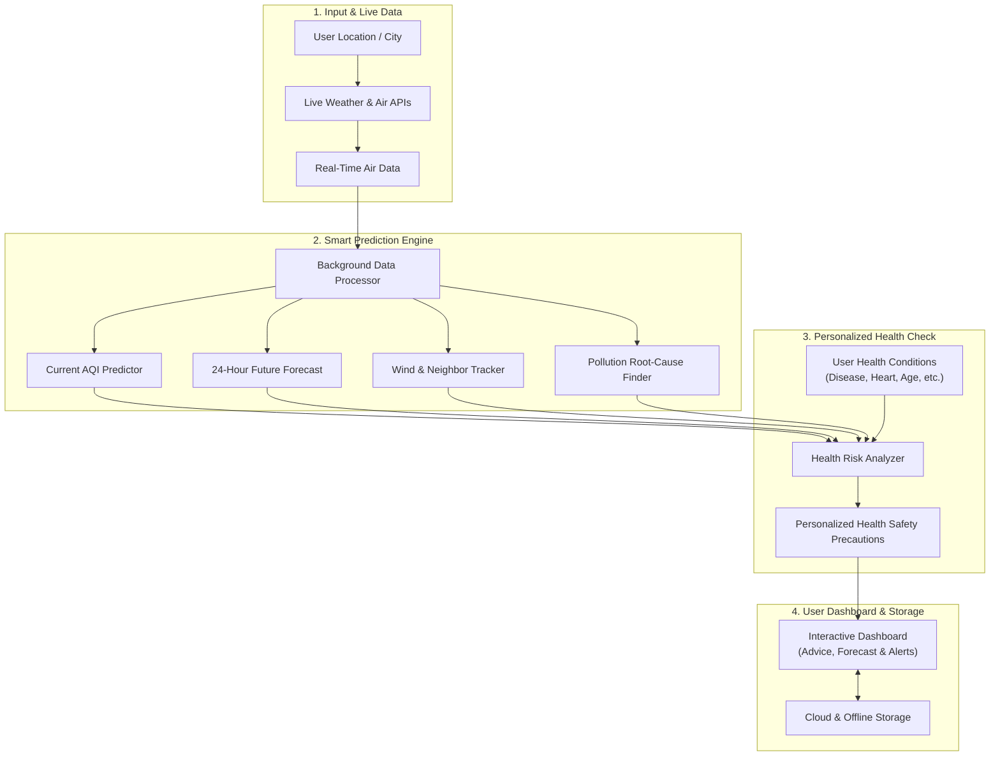

# 🌬️ AirFlow AI — Real-Time AQI Prediction & Personalized Clinical Risk Engine


> [!NOTE]
> **Architecture Update (v7.0.0):** The inference engine now integrates a **PyTorch BiLSTM model** exported via ONNX for advanced 24-hour time-series forecasting, complementing the existing XGBoost instantaneous risk classifier.

[](https://github.com/srirajpillai/AQI-Prediction)
[](https://opensource.org/licenses/MIT)
[](#-machine-learning--predictive-modeling)
[](#-system-architecture)
[](https://github.com/srirajpillai/AQI-Prediction)

**AirFlow AI** is a next-generation, client-side environmental intelligence platform. It moves beyond static single-number air quality displays by combining **real-time atmospheric sensor ingestion**, **24-hour predictive trajectory forecasting**, **cross-city spatial wind advection**, **Explainable AI (SHAP factor attribution)**, and a **personalized clinical disease risk engine**.

The application runs **100% client-side** using Vanilla HTML5, CSS3, ES6+ JavaScript, and a multi-threaded browser **Web Worker (`worker.js`)** for zero-latency machine learning inference without requiring a Python backend server at runtime.

---

## 🌟 Key Highlights & Innovations

### 1. 🛰️ Live Real-Time Environmental Ingestion
- Ingests hourly real-time concentrations of criteria air pollutants ($\text{PM}_{2.5}$, $\text{PM}_{10}$, $\text{NO}_2$, $\text{SO}_2$, $\text{CO}$, $\text{O}_3$, Dust) and atmospheric weather variables (Temperature, Humidity, Wind Speed/Direction, Surface Pressure) from open meteorological APIs.
- Features a **5-minute in-memory TTL cache** and `AbortController` request cancellation to prevent redundant network calls and eliminate race conditions.

### 2. 📈 24-Hour Hourly Trajectory Forecasting
- Simulates planetary boundary layer dynamics, morning traffic emissions, afternoon solar convective dispersion, and nighttime cooling particle settling.
- Generates hour-by-hour interactive prediction curves with user-friendly plain-English factors (e.g., *Morning Traffic & Cooler Air*, *Afternoon Sunlight & Good Airflow*).

### 3. 💨 Cross-City Spatial Advection (Smoke & Smog Tracking)
- Calculates distances to neighboring monitoring hubs using the **Haversine great-circle formula**:
  $$d = 2R \arcsin\left(\sqrt{\sin^2\left(\frac{\Delta \phi}{2}\right) + \cos(\phi_1)\cos(\phi_2)\sin^2\left(\frac{\Delta \lambda}{2}\right)}\right)$$
- Projects wind direction vectors ($\cos \theta$) and wind speed transport to alert users when upwind smog within 100 km is blowing into their location.

### 4. 🔍 Explainable AI (SHAP Factor Attribution)
- Decomposes the final AQI into exact positive (polluting) and negative (cleaning) point contributions (e.g., vehicular $\text{NO}_2$ plumes, biomass $\text{PM}_{2.5}$, rain scavenging, wind ventilation) for full transparency.

### 5. 🩺 Personalized Clinical Disease Risk Engine
- Evaluates individual sensitivity across **6 clinical disease categories**:
  1. **Respiratory:** Asthma, COPD, Bronchitis, Allergic Rhinitis.
  2. **Cardiovascular & Metabolic:** Heart Disease, Hypertension, Diabetes, Stroke History.
  3. **Eye & Skin Irritation:** Conjunctival inflammation, barrier protection advisories.
  4. **Neurological & Cognitive:** Blood-brain barrier particulate crossing, headache/fatigue alerts.
  5. **Maternal & Fetal Health:** Placental barrier vulnerability, stringent pregnancy thresholds.
  6. **Long-Term Preventive Health:** Cumulative particulate exposure tracking and spirometry guidance.
- Computes individual clinical risk scores ($0–100$) and generates tailored medical precautions.

### 6. ☁️ Cloud Profile Synchronization & Local Storage
- Synchronizes user medical health profiles securely via **Supabase Cloud PostgreSQL** using **Row Level Security (RLS)** (`auth.uid() = uid`).
- Instant fallback to browser `localStorage` for guest users, preserving theme preferences and last visited cities without requiring authentication.

---

## 🗺️ System Architecture



### 🎙️ How to Explain This Architecture in Your Presentation (4 Simple Steps)

| Step | What It Does (Simple Explanation) |
| :--- | :--- |
| **1. Live Data Ingestion** | The user selects a city or uses GPS. The system fetches live weather and air quality measurements (dust, smoke, gases, temperature, and wind) from open environmental services. |
| **2. Smart Prediction Engine** | All AI calculations run directly inside the browser so the app stays fast and smooth. It calculates the current air quality level, predicts the next 24 hours hour-by-hour, checks if wind is blowing smog from neighboring cities, and highlights the primary cause of pollution. |
| **3. Personalized Health Engine** | Different people have different health needs. The engine checks the pollution levels against the user's health profile (such as asthma, heart conditions, elderly status, or pregnancy) to give a personalized risk score (0 to 100) and practical safety precautions. |
| **4. User Dashboard & Storage** | Results are displayed on a clean visual dashboard with an animated gauge, 24-hour forecast curve, and clear advice. Settings and profiles are saved securely in the cloud and stored locally for instant offline loading. |

---

## 📁 Repository File Structure

```
version1/
│
├── 🌐 FRONTEND APPLICATION
│   ├── index.html                   # Main dashboard (AQI gauge, 24-hr forecast, pollutant cards, modals)
│   ├── app.js                       # Main controller: API fetchers, health engine, DOM updater, auth
│   ├── worker.js                    # Background Web Worker: ML inference, diurnal trajectories, spatial wind, SHAP
│   ├── styles.css                   # Glassmorphic design system, light/dark themes, responsive layouts
│   ├── know-how.html                # Educational page explaining SHAP AI math & medical risks
│   ├── know-how.js                  # Interactive SHAP visualizer & clinical tabs for Know-How page
│   ├── about.html                   # Project methodology, architecture documentation, team credits
│   ├── about.js                     # Interactive navigation, 3D tilt, and theme sync for About page
│   └── manifest.json                # Progressive Web App (PWA) manifest configuration
│
├── 🤖 MACHINE LEARNING PIPELINE (PYTHON)
│   ├── train_model.py               # Consolidated Python training pipeline (XGBoost & Ridge)
│   ├── ml_model.json                # Serialized model weights & breakpoints used by worker.js
│   ├── ml_model.pkl                 # Trained Python binary model (Joblib pipeline)
│   └── datasets/                    # Directory holding raw & compiled air quality data (CSVs)
│       ├── latest_aqi_hourly_2020_2026.csv # Continuous hourly observation dataset
│       ├── latest_aqi_daily_2020_2026.csv  # Aggregated daily multi-city dataset
│       ├── city_day.csv             # CPCB India historical reference
│       ├── stations.csv             # Monitoring station registry
│       └── dataset_metadata.json    # JSON catalog describing dataset schemas & provenance
│
├── ☁️ CONFIGURATION & DEPLOYMENT
│   ├── supabase_schema.sql          # Supabase PostgreSQL schema & Row-Level Security (RLS) rules
│   ├── vercel.json                  # Vercel deployment configuration with clean URLs & CORS headers
│   ├── .gitignore                   # Git exclusion rules
│   ├── .gitattributes              # Git LFS & line ending definitions
│   └── .vercelignore                # Vercel build exclusion rules
│
└── 📋 DOCUMENTATION
    ├── PROJECT_VIVA_AND_PRESENTATION_PREP.txt # Master viva voce presentation guide (30+ Q&A)
    ├── PROJECT_GUIDE_AND_WORKFLOW.md     # Architecture workflow & operating guide
    ├── COMPLETE_AI_AGENT_PROJECT_GUIDE.md # Comprehensive master reference guide
    ├── PROJECT_REPORT.md                 # Complete Academic Major Project Report
    ├── SRS_DOCUMENT.md                    # Formal IEEE Software Requirements Specification
    ├── DATASETS_CATALOG.md                # Catalog of dataset files & feature metrics
    ├── DATASET_DOCUMENTATION.txt          # Pollutant units, thresholds, and citations
    └── README.md                          # THIS DOCUMENT (Project overview)
```

---

## 🤖 Machine Learning & Predictive Modeling

The machine learning models are trained on post-2022 continuous observations across monitoring stations in India from IMD and CPCB:
- **IMD & CPCB Daily Archive (`latest_aqi_daily_2020_2026.csv`)**
- **IMD & CPCB Hourly Archive (`latest_aqi_hourly_2020_2026.csv`)**

### Model Performance Benchmarks
| Model / Architecture | Algorithm | Target Variable | Performance Metric |
| :--- | :--- | :--- | :--- |
| **Risk Category Classifier** | XGBoost Multi-Class (`hist`) | 6 CPCB Tiers (Good to Severe) | **98.42% Classification Accuracy** |
| **Continuous AQI Regressor** | XGBoost Regressor | Numerical AQI (0–500+) | **$R^2 = 98.72\%$ \| MAE = 3.06 AQI pts** |
| **In-Browser Ridge Regressor** | Scikit-Learn Ridge (L2) | Real-Time Continuous AQI | **Serialized to `ml_model.json` (< 5ms)** |
| **Diurnal Atmospheric Regressor** | Ordinary Least Squares | 24-Hour $\Delta \text{AQI}(h)$ | **Trained Diurnal Weights** |

### Algorithm Comparison & Justification
| Algorithm / Model Type | Accuracy / Benchmark | Strengths | Weaknesses |
| :--- | :--- | :--- | :--- |
| **XGBoost (Selected)** | **98.42%** | Handles non-linear interactions, fast training, high precision. | Requires weight serialization for client-side use. |
| Random Forest | ~95.10% | Robust baseline ensemble, handles outliers well. | Slower evaluation in browser, larger memory footprint. |
| Deep Learning (LSTM/CNN) | ~94.00% | Captures sequential time-series patterns. | Black-box opacity, heavy compute, high browser latency. |
| Ridge Regression | ~82.00% | Extremely fast, zero-latency inference in Web Worker. | High bias at extreme AQI peaks due to non-linear breakpoints. |
| Support Vector Machine | ~88.50% | Good margin separation for small datasets. | Scales poorly to 130k+ records ($O(n^2)$ complexity). |

---

## 🚀 How to Run Locally

### Option 1: Instant Browser Launch (No Setup Required)
1. Open your file manager and navigate to the project directory:
   `d:\my files\Engineering\SEM 6\Major Project\Application\AQI Prediction\version1`
2. Double-click **`index.html`** to open it directly in Chrome, Edge, Firefox, or Brave.

---

### Option 2: Using VS Code Live Server (Recommended)
1. Open the project folder in **VS Code**.
2. Right-click **`index.html`** and select **"Open with Live Server"**.

---

### Option 3: Using Python Built-in Server (Terminal)
```powershell
# In terminal, navigate to the folder and run:
python -m http.server 8000
```
Open `http://localhost:8000` in your web browser.

---

## 🧪 Retraining the Machine Learning Models

To retrain the machine learning models and update `ml_model.json` & `ml_model.pkl`:

```powershell
# Step 1: Install dependencies
pip install pandas numpy scikit-learn xgboost joblib requests

# Step 2: Run the consolidated training pipeline
python train_model.py
```

---

## ☁️ Cloud Deployment

The repository is configured for static hosting platforms (Vercel, Netlify, GitHub Pages):

```powershell
# Deploy to Vercel
npx vercel --prod
```

---

## 📄 Documentation Index
- 📘 **[Academic Major Project Report (University Submission)](PROJECT_REPORT.md)**
- 🎓 **[Master Viva Voce & Presentation Preparation Guide (30+ Q&A)](PROJECT_VIVA_AND_PRESENTATION_PREP.txt)**
- 🏗️ **[Architecture & Operational Workflow Guide](PROJECT_GUIDE_AND_WORKFLOW.md)**
- 📖 **[Complete AI Agent Master Guide](COMPLETE_AI_AGENT_PROJECT_GUIDE.md)**
- 📊 **[Datasets Catalog & Feature Metrics](DATASETS_CATALOG.md)**
- 📐 **[Software Requirements Specification (SRS)](SRS_DOCUMENT.md)**
- 📋 **[Dataset Documentation & Definitions](DATASET_DOCUMENTATION.txt)**

---

*AirFlow AI — Major Project SEM 6.*
