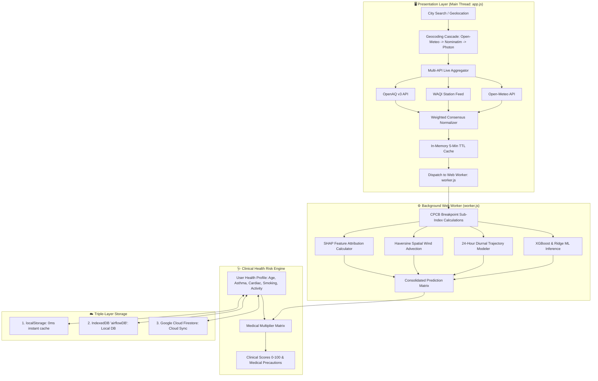

# 🌬️ AirFlow AI — Real-Time AQI Prediction & Personalized Clinical Risk Engine

[](https://github.com/srirajpillai/AQI-Prediction)
[](https://opensource.org/licenses/MIT)
[](#-machine-learning--predictive-modeling)
[](#-system-architecture)
[](https://github.com/srirajpillai/AQI-Prediction)

**AirFlow AI** is a next-generation, client-side environmental intelligence platform. It moves beyond static single-number air quality displays by combining **Multi-API consensus**, **24-hour diurnal trajectory forecasting**, **cross-city spatial wind advection**, **Explainable AI (SHAP factor attribution)**, and a **personalized clinical disease risk engine**.

The application runs **100% client-side** using Vanilla HTML5, CSS3, ES6+ JavaScript, and a multi-threaded browser **Web Worker (`worker.js`)** for zero-latency machine learning inference without requiring a Python backend server at runtime.

---

## 🌟 Key Highlights & Innovations

### 1. 🛰️ Multi-API Weighted Consensus Engine
- Simultaneously queries **Open-Meteo**, **WAQI (World Air Quality Index)**, and **OpenAQ v3** in parallel.
- Computes a weighted consensus ($\text{AQI}_{\text{final}} = \text{Open-Meteo} \times 0.60 + \text{WAQI/OpenAQ} \times 0.40$) to eliminate individual sensor noise and report trustworthy metrics with a live `🛰 2 Sources` badge.

### 2. 📈 24-Hour Diurnal Trajectory Forecasting
- Simulates planetary boundary layer dynamics, morning rush-hour stagnation, afternoon thermal convection dispersal, and nocturnal cooling entrapment.
- Generates hour-by-hour interactive prediction curves with meteorological factor flags.

### 3. 💨 Cross-City Spatial Advection (Smoke & Smog Tracking)
- Calculates distance to neighboring monitoring hubs using the **Haversine great-circle formula**:
  $$d = 2R \arcsin\left(\sqrt{\sin^2\left(\frac{\Delta \phi}{2}\right) + \cos(\phi_1)\cos(\phi_2)\sin^2\left(\frac{\Delta \lambda}{2}\right)}\right)$$
- Projects wind direction vectors ($\cos \theta$) and wind speed transport to alert users when upwind smog within 100 km is blowing into their city.

### 4. 🔍 Explainable AI (SHAP Factor Attribution)
- Decomposes the final AQI into exact positive (polluting) and negative (cleaning) point contributions (e.g., vehicular $NO_2$ plumes, biomass $PM_{2.5}$, rain scavenging, wind ventilation).

### 5. 🩺 Personalized Clinical Disease Risk Engine
- Evaluates individual sensitivity across **6 clinical disease categories**:
  1. **Respiratory:** Asthma, COPD, Bronchitis, Allergic Rhinitis, Sleep Apnea.
  2. **Cardiovascular & Metabolic:** Heart Disease, Hypertension, Diabetes, Stroke History.
  3. **Eye & Skin Irritation:** Conjunctival inflammation, barrier cream advisories.
  4. **Neurological & Cognitive:** Blood-brain barrier particulate crossing, CO alarms.
  5. **Maternal & Fetal Health:** Placental transfer risk, stringent pregnancy thresholds.
  6. **Long-Term Cancer Risk:** Cumulative IARC Group 1 $PM_{2.5}$ exposure and spirometry advice.
- Computes individual clinical risk scores ($0–100$) and generates tailored medical precautions.

### 6. ☁️ Triple-Layer Persistence with Optimistic UI
- Synchronizes user profiles seamlessly across **Google Cloud Firestore**, **IndexedDB (`airflowDB`)**, and **localStorage**.
- Features **Optimistic UI updates**: instantly saves locally and updates the dashboard, while quietly syncing to Firestore in the background with exponential backoff retries.

### 7. ⚡ Performance & Thermal Optimization
- **Page Visibility API (`document.visibilityState`):** Automatically halts canvas animation loops and mouse glow tracking when the tab is hidden, preventing laptop heating and battery drain.
- **Light Mode Default:** Modern, accessible light theme with a specialized 0.4px text stroke on yellow AQI text for optimal contrast.

---

## 🗺️ System Architecture



---

## 📁 Repository File Structure

```
version1/
│
├── 🌐 FRONTEND APPLICATION
│   ├── index.html                   # Main dashboard (AQI gauge, 24-hr forecast, pollutant cards, modals)
│   ├── app.js                       # Main controller: Multi-API fetcher, health engine, DOM updater, auth
│   ├── worker.js                    # Background Web Worker: ML inference, diurnal trajectories, spatial wind, SHAP
│   ├── styles.css                   # Glassmorphic design system, light/dark themes, responsive layouts
│   ├── know-how.html                # Educational page explaining SHAP AI math & medical risks
│   ├── know-how.js                  # Interactive SHAP visualizer & clinical tabs for Know-How page
│   ├── about.html                   # Project methodology, architecture documentation, team credits
│   ├── about.js                     # Interactive navigation, 3D tilt, and theme sync for About page
│   └── manifest.json                # Progressive Web App (PWA) manifest configuration
│
├── 🤖 MACHINE LEARNING PIPELINE (PYTHON)
│   ├── train_model.py               # Consolidated Python training pipeline (XGBoost & Ridge)
│   ├── ml_model.json                # Serialized model weights & breakpoints used by worker.js
│   ├── ml_model.pkl                 # Trained Python binary model (Joblib pipeline)
│   └── datasets/                    # Directory holding raw & compiled air quality data (CSVs)
│       ├── latest_aqi_hourly_2020_2026.csv # Continuous hourly observation dataset
│       ├── latest_aqi_daily_2020_2026.csv  # Aggregated daily multi-city dataset
│       ├── city_day.csv             # CPCB India historical reference
│       ├── stations.csv             # Monitoring station registry
│       └── dataset_metadata.json    # JSON catalog describing dataset schemas & provenance
│
├── ☁️ CONFIGURATION & DEPLOYMENT
│   ├── supabase_schema.sql          # Supabase PostgreSQL schema & Row-Level Security (RLS) rules
│   ├── vercel.json                  # Vercel deployment configuration with clean URLs & CORS headers
│   ├── .gitignore                   # Git exclusion rules
│   ├── .gitattributes              # Git LFS & line ending definitions
│   └── .vercelignore                # Vercel build exclusion rules
│
└── 📋 DOCUMENTATION
    ├── COMPLETE_AI_AGENT_PROJECT_GUIDE.md # Comprehensive master reference guide
    ├── PROJECT_VIVA_AND_PRESENTATION_PREP.txt # Master viva voce presentation guide
    ├── PROJECT_GUIDE_AND_WORKFLOW.md     # Architecture workflow & operating guide
    ├── SRS_DOCUMENT.md                    # Formal IEEE Software Requirements Specification
    ├── DATASETS_CATALOG.md                # Comprehensive catalog of all dataset files
    ├── DATASET_DOCUMENTATION.txt          # Pollutant units, thresholds, and citations
    └── README.md                          # THIS DOCUMENT (Project overview)
```

---

## 🤖 Machine Learning & Predictive Modeling

The machine learning models are trained on post-2022 continuous observations across monitoring stations in India from IMD and CPCB:
- **IMD & CPCB Daily Archive (`latest_aqi_daily_2020_2026.csv`)**
- **IMD & CPCB Hourly Archive (`latest_aqi_hourly_2020_2026.csv`)**

### Model Evaluation Metrics
| Model | Algorithm | Target Variable | Performance Metric |
| :--- | :--- | :--- | :--- |
| **Risk Category Classifier** | XGBoost Multi-Class (`hist`) | 6 CPCB Tiers (Good to Severe) | **98.42% Accuracy** |
| **Continuous AQI Regressor** | XGBoost Regressor | Numerical AQI (0–500+) | **$R^2 = 98.72\%$ \| MAE = 3.06** |
| **Diurnal Response Modeler** | Multi-Variable Linear/Ridge | Diurnal $\Delta \text{AQI}(h)$ | Serialized to `ml_model.json` |

---

## 🚀 How to Run Locally

### Option 1: Instant Browser Launch (No Setup Required)
1. Open your file manager and navigate to the project directory:
   `d:\my files\Engineering\SEM 6\Major Project\Application\AQI Prediction\version1`
2. Double-click **`index.html`** to open it directly in Chrome, Edge, Firefox, or Brave.

---

### Option 2: Using VS Code Live Server (Recommended)
1. Open the `version1` folder in **Visual Studio Code**.
2. Right-click `index.html` $\rightarrow$ Select **"Open with Live Server"**.
3. Access the live-reloading dashboard at `http://127.0.0.1:5500/index.html`.

---

### Option 3: Using Node.js or Python Static Servers
```powershell
# Using Node.js
npx serve .
# OR
npx live-server

# Using Python
python -m http.server 8000
```
Open `http://localhost:8000` in your web browser.

---

## 🧪 Retraining the Machine Learning Models

To recompile datasets, retrain the models, and update `ml_model.json` & `ml_model.pkl`:

```powershell
# Step 1: Install data science dependencies
pip install pandas numpy scikit-learn xgboost joblib requests

# Step 2: Run the consolidated master pipeline
python unified_master_pipeline.py --all
```

Command-line flags available:
- `--all`: Runs the entire pipeline (compilation + ML training + export).
- `--compile`: Compiles datasets into `datasets/comprehensive_aqi_master_dataset.csv` only.
- `--train`: Trains the XGBoost models and exports `ml_model.pkl` and `ml_model.json`.

---

## ☁️ Cloud Deployment

The repository is configured for static hosting platforms (Vercel, Netlify, GitHub Pages):

```powershell
# Deploy to Vercel
npx vercel --prod
```

---

## 📄 Documentation Index
- 📘 **[Academic Major Project Report (University Submission)](PROJECT_REPORT.md)**
- 📖 [Complete AI Agent Master Guide (Markdown)](COMPLETE_AI_AGENT_PROJECT_GUIDE.md)
- 📄 [Complete AI Agent Master Guide (Plaintext)](COMPLETE_AI_AGENT_PROJECT_GUIDE.txt)
- 📊 [Datasets Catalog & Schema](DATASETS_CATALOG.md)
- 📐 [Software Requirements Specification (SRS)](SRS_DOCUMENT.md)
- 🏗️ [Architecture & Operational Workflow Guide](PROJECT_GUIDE_AND_WORKFLOW.md)
- 💡 [Simplified Project Explanation](project_explanation.txt)

---

*AirFlow AI — Major Project SEM 6.*

